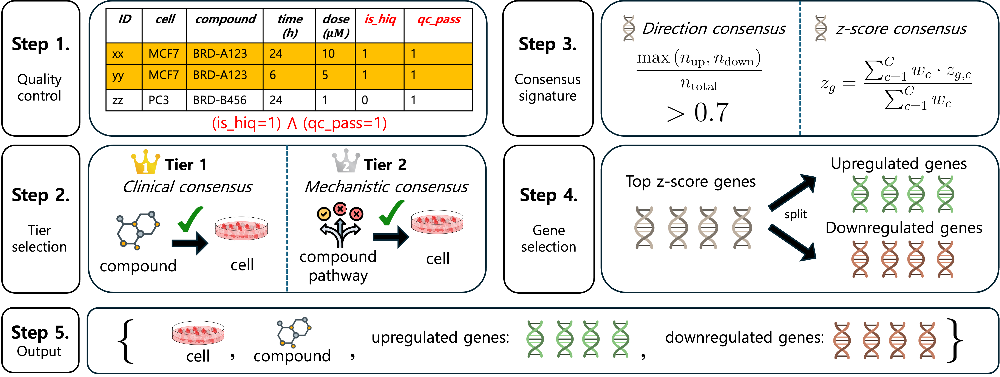
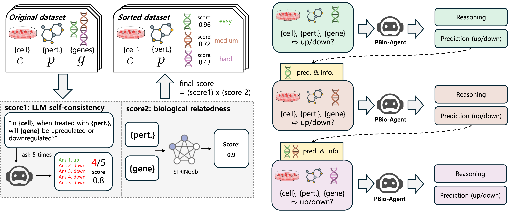

# Progressive Multi-Agent Reasoning for Biological Perturbation Prediction


## LINCSQA Benchmark

<p align="center">
  
</p>

**LINCSQA** is a benchmark for evaluating biological QA systems on gene regulation prediction. Constructed from the LINCS L1000 perturbation database, it provides ground-truth gene expression changes across multiple organs and cell lines.

---

## PBio-Agent 

<p align="center">
  
</p>

**PBio-Agent** is a multi-agent system combining:
- **3 Scientist Agents** (Context, Mechanism, Network) for specialized biological reasoning
- **1 Integration Agent** synthesizing reasoning with optional GAT predictions
- **4 Judge Agents** (History Leakage, Target Verifier, Consistency, Logic) for quality validation
- **Retry Logic** for iterative refinement

---

## Tasks

| Task | Description | Answer Format | GAT |
|------|-------------|---------------|-----|
| **Task1** | Gene regulation direction prediction | upregulated / downregulated | ✅ Enabled |
| **Task2** | MoA prediction case study | yes / no / uncertain | ❌ Disabled |

---

## Installation

```bash
pip install -r requirements.txt
```

---

## Quick Start

### Task1: Gene Regulation Direction Prediction

```bash
python run.py --task_type task1 --use_gat --organs blood \
    --model_name deepseek-ai/DeepSeek-R1-Distill-Llama-8B
```

### Task2: MoA Prediction Case Study

```bash
python run.py --task_type task2 --no_gat --allow_uncertain \
    --case_study case2_kras --organs blood
```

---

## Data Structure

### Input
```
# Task1
data/lincsqa/gene_regulation_dir_pred/combined_score/{model_name}/{organ}/task1/...

# Task2
data/lincsqa/case_study/sorted/combined_score/{model_name}/{case_study}/task2/...
```

### Output
```
results/{project_name}/{model_name}/{organ}/{task_type}/{test_case_id}/{gt_moa}/{compound}/{candidate_moa}_{seed}.json
```

---

## Command Line Arguments

| Argument | Description | Default |
|----------|-------------|---------|
| `--task_type` | `task1` or `task2` | Required |
| `--case_study` | `case1_braf` or `case2_kras` (task2 only) | Required for task2 |
| `--use_gat` / `--no_gat` | Enable/disable GAT | task1: on, task2: off |
| `--allow_uncertain` | Allow 'uncertain' answers | False |
| `--organs` | Organs to process | Required |
| `--model_name` | LLM model | `deepseek-ai/DeepSeek-R1-Distill-Llama-8B` |
| `--seed` | Random seed | 0 |
| `--batch_size` | Batch size | 2 |
| `--max_retry` | Max retry attempts | 2 |

---

## Metrics Calculation

### Gene regulation prediction AUROC Metrics

Calculate organ-wise AUROC and Accuracy from gene regulation prediction results:

```bash
# Basic usage
python metrics/gene_regulation_prediction.py --results_dir results/{project_name}/{model_name}

# Example
python metrics/gene_regulation_prediction.py --results_dir results/pbioagent_project/deepseek-ai-DeepSeek-R1-Distill-Llama-8B

# Specify organs
python metrics/gene_regulation_prediction.py --results_dir results/pbioagent_project/deepseek-ai-DeepSeek-R1-Distill-Llama-8B \
    --organs lung peripheral_blood

# Specify seeds
python metrics/gene_regulation_prediction.py --results_dir results/pbioagent_project/deepseek-ai-DeepSeek-R1-Distill-Llama-8B \
    --seeds 0 1 2

# Output LaTeX table format
python metrics/gene_regulation_prediction.py --results_dir results/pbioagent_project/deepseek-ai-DeepSeek-R1-Distill-Llama-8B \
    --latex
```

#### Metrics Script Arguments

| Argument | Description | Default |
|----------|-------------|---------|
| `--results_dir` | Base results directory (required) | - |
| `--organs` | Organs to evaluate | All 8 organs |
| `--seeds` | Seeds to check | [0, 1, 2] |
| `--latex` | Print LaTeX table format | False |

#### Output

The script reports:
- **AUROC**: Organ-wise AUROC with mean ± std across seeds
- **Accuracy**: Organ-wise accuracy for cases where AUROC cannot be computed (single-class data)
- **Missing Seeds Report**: Lists seeds without data files
- **Single-Class Data Report**: Details cases where AUROC is not computable

---

## Project Structure

```
LINCSQA_PBIOAGENT/
├── run.py                      # Unified entry point
├── utils/                      # Modular pipeline components
│   ├── llm_client.py           # VLLM server client
│   ├── agents.py               # Scientist agents
│   ├── judges.py               # Judge agents
│   ├── orchestrator.py         # Pipeline coordinator
│   ├── pipeline_data_loader.py # Data loading
│   └── result_saver.py         # Result saving
├── metrics/
│   └── gene_regulation_prediction.py                # Task1 AUROC metrics calculator
├── bash/
│   ├── run_task1.sh            # Task1 script
│   └── run_task2.sh            # Task2 script
├── checkpoints/                # GAT checkpoints
├── data/                       # Benchmark data
└── assets/                     # Figures
```
