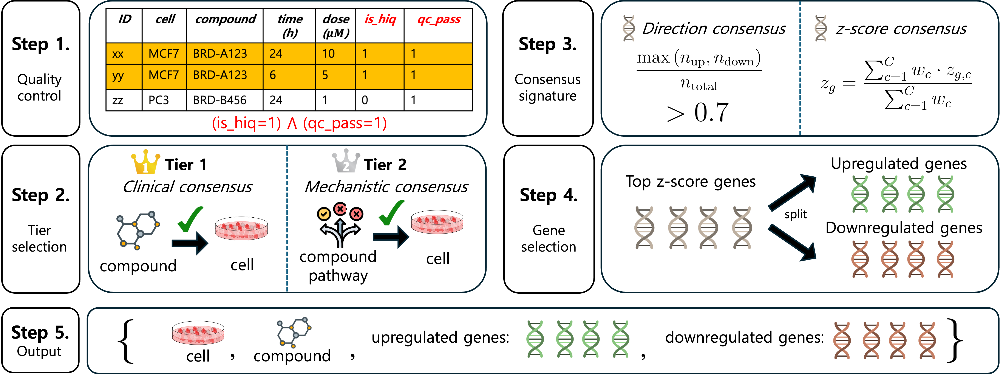
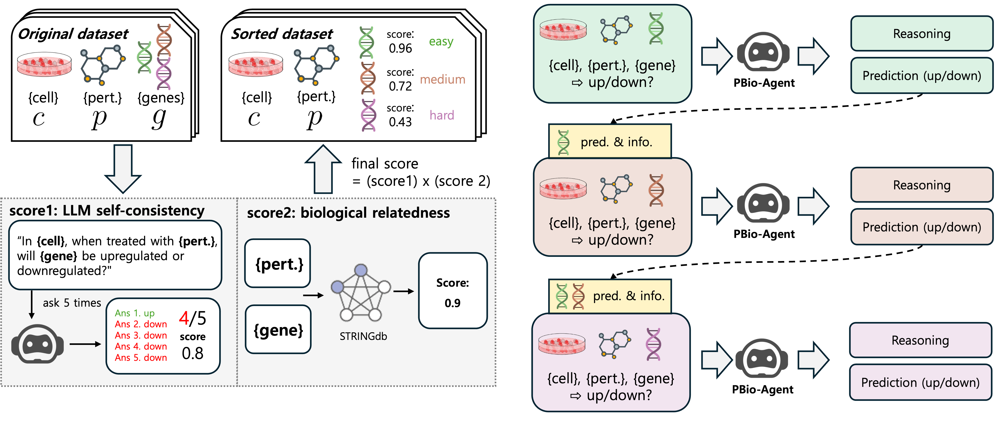

# Progressive Multi-Agent Reasoning for Biological Perturbation Prediction


* [Paper](https://arxiv.org/abs/2602.07408)
* [Project page](https://icecream126.github.io/LINCSQA_PBIOAGENT_project_page/)
* [Dataset and checkpoint](https://zenodo.org/records/18767361)


## LINCSQA Benchmark

<p align="center">
  
</p>

**LINCSQA** is a benchmark for evaluating biological QA systems on gene regulation prediction. Constructed from the LINCS L1000 perturbation database, it provides ground-truth gene expression changes across multiple organs and cell lines.

---

## PBio-Agent 

<p align="center">
  
</p>

**PBio-Agent** is a multi-agent system combining:
- **3 Scientist Agents** (Context, Mechanism, Network) for specialized biological reasoning
- **1 Integration Agent** synthesizing reasoning with optional GAT predictions
- **4 Judge Agents** (History Leakage, Target Verifier, Consistency, Logic) for quality validation
- **Retry Logic** for iterative refinement

---

## Tasks

| Task | Description | Answer Format | GAT |
|------|-------------|---------------|-----|
| **Task1** | Gene regulation direction prediction | upregulated / downregulated | ✅ Enabled |
| **Task2** | MoA prediction case study | yes / no / uncertain | ❌ Disabled |

---

## Installation

```bash
pip install -r requirements.txt
```

---

## Quick Start

### Task1: Gene Regulation Direction Prediction

```bash
python run.py --task_type task1 --use_gat --organs blood \
    --model_name deepseek-ai/DeepSeek-R1-Distill-Llama-8B
```

### Task2: MoA Prediction Case Study

```bash
python run.py --task_type task2 --no_gat --allow_uncertain \
    --case_study case2_kras --organs blood
```

---


## Command Line Arguments

| Argument | Description | Default |
|----------|-------------|---------|
| `--task_type` | `task1` or `task2` | Required |
| `--case_study` | `case1_braf` or `case2_kras` (task2 only) | Required for task2 |
| `--use_gat` / `--no_gat` | Enable/disable GAT | task1: on, task2: off |
| `--allow_uncertain` | Allow 'uncertain' answers | False |
| `--organs` | Organs to process | Required |
| `--model_name` | LLM model | `deepseek-ai/DeepSeek-R1-Distill-Llama-8B` |
| `--seed` | Random seed | 0 |
| `--batch_size` | Batch size | 2 |
| `--max_retry` | Max retry attempts | 2 |

---

## Metrics Calculation

### Gene regulation prediction AUROC Metrics

Calculate organ-wise AUROC and Accuracy from gene regulation prediction results:

```bash
# Basic usage
python metrics/gene_regulation_prediction.py --results_dir results/{project_name}/{model_name}

# Example
python metrics/gene_regulation_prediction.py --results_dir results/pbioagent_project/deepseek-ai-DeepSeek-R1-Distill-Llama-8B

# Specify organs
python metrics/gene_regulation_prediction.py --results_dir results/pbioagent_project/deepseek-ai-DeepSeek-R1-Distill-Llama-8B \
    --organs lung peripheral_blood

# Specify seeds
python metrics/gene_regulation_prediction.py --results_dir results/pbioagent_project/deepseek-ai-DeepSeek-R1-Distill-Llama-8B \
    --seeds 0 1 2

# Output LaTeX table format
python metrics/gene_regulation_prediction.py --results_dir results/pbioagent_project/deepseek-ai-DeepSeek-R1-Distill-Llama-8B \
    --latex
```

#### Metrics Script Arguments

| Argument | Description | Default |
|----------|-------------|---------|
| `--results_dir` | Base results directory (required) | - |
| `--organs` | Organs to evaluate | All 8 organs |
| `--seeds` | Seeds to check | [0, 1, 2] |
| `--latex` | Print LaTeX table format | False |

#### Output

The script reports:
- **AUROC**: Organ-wise AUROC with mean ± std across seeds
- **Accuracy**: Organ-wise accuracy for cases where AUROC cannot be computed (single-class data)
- **Missing Seeds Report**: Lists seeds without data files
- **Single-Class Data Report**: Details cases where AUROC is not computable

---

## Project Structure

```
LINCSQA_PBIOAGENT/
├── run.py                      # Unified entry point
├── utils/                      # Modular pipeline components
│   ├── llm_client.py           # VLLM server client
│   ├── agents.py               # Scientist agents
│   ├── judges.py               # Judge agents
│   ├── orchestrator.py         # Pipeline coordinator
│   ├── pipeline_data_loader.py # Data loading
│   └── result_saver.py         # Result saving
├── metrics/
│   └── gene_regulation_prediction.py   # Task1 AUROC metrics calculator
├── bash/
│   ├── run_task1.sh            # Task1 script
│   └── run_task2.sh            # Task2 script
├── checkpoints/                # GAT checkpoints
├── data/
│   ├── kg/                     # Knowledge graph data (see Data Setup)
│   ├── lincsqa/                # Full LINCSQA benchmark data
│   ├── lincsqa_small/          # Small subset for demo/testing
│   ├── metadata/               # Cell, compound, STRINGdb metadata
│   └── templates/              # Chat templates for LLMs
├── results/                    # Pipeline output
└── assets/                     # Figures
```

---

## Data & Checkpoint Setup

### 0. Download checkpoint and data
Download checkpoint and data at [here](https://zenodo.org/records/18767361 
).

### 1. Knowledge Graph (`data/kg/`)

The `data/kg/` directory requires data from **two sources** that must be merged together:

1. **PerturbQA Dataset (Zenodo)**: Download the `kg/` folder from the PerturbQA dataset at [https://zenodo.org/records/14915313](https://zenodo.org/records/14915313).
2. **This Repository**: The `data/kg/` folder already contains additional knowledge graph files provided by this project.

To set up, download the `kg/` folder from the Zenodo dataset and merge its contents into `data/kg/`, combining them with the files already present in this repository. Both sources are required for the pipeline to function correctly.

After merging, the directory should have the following structure:

```
data/kg/
├── bioplex.json
├── corum.json
├── corum_gsea.json
├── corum_human_5.1.txt
├── ensembl.json
├── go.json
├── go_dict.json
├── go_gsea.json
├── reactome.json
├── reactome_gsea.json
├── string.json
├── uniprot.json
├── depmap/                         # DepMap dependency data
│   ├── CRISPRGeneDependency.csv
│   ├── CRISPRGeneEffect.csv
│   ├── CRISPRInferredCommonEssentials.csv
│   ├── Model.csv
│   └── PortalCompounds.csv
└── signor/                         # SIGNOR signaling network
    ├── edges.csv
    └── nodes.csv
```

### 2. STRINGdb (`data/metadata/STRINGdb/`)

The STRINGdb protein interaction files can be downloaded from the [STRING database (Homo sapiens)](https://string-db.org/cgi/download?species_text=Homo+sapiens):

- **`9606.protein.info.v12.0.txt`** - Protein information (names, annotations)
- **`9606.protein.links.v12.0.txt`** - Protein-protein interaction links with combined scores

Download these two files and place them in `data/metadata/STRINGdb/`.

### 3. Full Data Directory Structure

```
data/
├── kg/                                 # Knowledge graph (see section 1 above)
│   ├── bioplex.json
│   ├── corum.json
│   ├── corum_gsea.json
│   ├── corum_human_5.1.txt
│   ├── ensembl.json
│   ├── go.json
│   ├── go_dict.json
│   ├── go_gsea.json
│   ├── reactome.json
│   ├── reactome_gsea.json
│   ├── string.json
│   ├── uniprot.json
│   ├── depmap/
│   │   ├── CRISPRGeneDependency.csv
│   │   ├── CRISPRGeneEffect.csv
│   │   ├── CRISPRInferredCommonEssentials.csv
│   │   ├── Model.csv
│   │   └── PortalCompounds.csv
│   └── signor/
│       ├── edges.csv
│       └── nodes.csv
├── lincsqa/                            # Full LINCSQA 
│   ├── gene_regulation_dir_pred/       # Task1 data
│   │   └── combined_score/{model_name}/{organ}/task1/...
│   └── case_study/                     # Task2 data
│       ├── sorted/combined_score/{model_name}/{case_study}/task2/...
│       └── unsorted/
└── metadata/
    ├── cell/
    │   └── cellosaurus.json            # Cell line metadata
    ├── compound_moa/
    │   ├── domain_knowledge_mapping.json
    │   └── moa_target_mapping.json
    └── STRINGdb/                       # STRING protein 
        ├── 9606.protein.info.v12.0.txt
        └── 9606.protein.links.v12.0.txt
```
